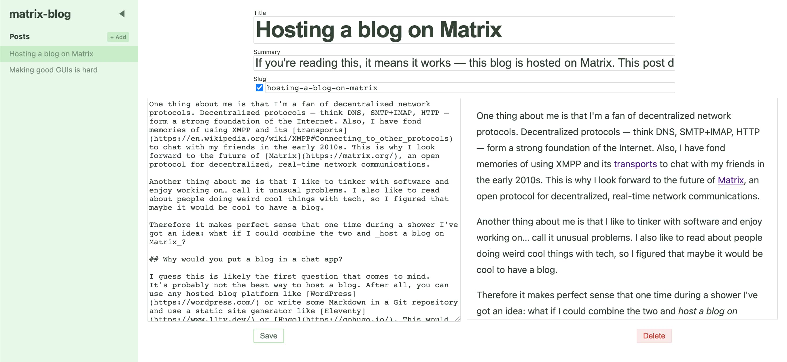

# matrix-blog-admin

This is a [SvelteKit](https://kit.svelte.dev/) app that I use to edit posts on [evolved.systems](https://evolved.systems/). It uses [matrix-blog](https://github.com/evoL/matrix-blog/) to communicate with my Matrix homeserver.

> **Warning:** Please don't expose this app online! There's no authorization, so anyone could do things on the Matrix server on your behalf. Also, the code is very alpha quality. You probably don't want to use this in production.



## Prerequisites

In order to successfully use this to write blog posts, you need:

-   node.js and npm, OR docker. I tested this with node.js 14. 
-   A pre-existing Matrix space. Create one in [Element](https://app.element.io/).
-   An access token to your Matrix homeserver. You can obtain one by sending an API request to your homeserver (replace `matrix.example.com`, `USERNAME` and `PASSWORD` with your homeserver address and your credentials).

    ```sh
    curl -XPOST \
        -H "Content-type: application/json" \
        -d '{"type":"m.login.password","identifier":{"type":"m.id.user","user":"USERNAME"},"password":"PASSWORD"}' \
        'https://matrix.example.com/_matrix/client/r0/login'
    ```

    The response will look similar to this:

    ```json
    {
        "user_id": "@USERNAME:example.com",
        "access_token": "THATS_YOUR_ACCESS_TOKEN",
        "home_server": "example.com",
        "device_id": "blog",
        "well_known": {
            "m.homeserver": { "base_url": "https://matrix.example.com/" },
            "m.identity_server": { "base_url": "https://example.com" }
        }
    }
    ```

## Setting up for development

1. Clone this repo: `git clone https://github.com/evoL/matrix-blog-admin`.
2. Make a copy of `.env.sample` and call it `.env`.

   **Note:** You can also create `.env` files per environment. [Consult the Vite docs](https://vitejs.dev/guide/env-and-mode.html#env-files) how to do it.

3. Fill in the `.env` file with necessary information:

   - `VITE_MATRIX_SERVER_NAME` — Name of your Matrix server. If your Matrix username is `@username:example.com`, the server name is `example.com`.
   - `VITE_MATRIX_HOMESERVER_URL` — The actual HTTPS URL of your Matrix server. If your server uses delegation, you can find the hostname under `https://SERVER_NAME/.well-known/matrix/client`.
   - `VITE_MATRIX_BLOG_ROOM_ID` — The room ID of the Matrix space you want to use for the blog. Looks like `!randomtext:SERVER_NAME`. Find it in Element Web under `Space Settings (the cog button) > View dev tools > Room ID`.
   - `VITE_MATRIX_ACCESS_TOKEN` — The access token to use to authenticate requests to Matrix.

4. Install dependencies: `npm install`

5. Run the devserver: `npm run dev`

The server will run at http://localhost:3000/.

## Building a standalone node.js app

1. Make sure your `.env` file is populated with correct values.
2. Run `npm run build`

At this point you have a `build/` directory that contains a plain node.js app. You can verify that it works by running `npm run preview`.

## Deploying to production

1. Build the app using [the instructions above](#building-a-standalone-nodejs-app).
2. Copy `package.json`, `package-lock.json` and the `build/` directory to the production machine.
3. On the production machine, `cd` to the directory with the above files.
4. Run `npm install --production` to install dependencies.
5. Run `node build` to start the server. The app will be accessible on port 3000 by default.
    - You can change the bind host and port by setting the `HOST` and `PORT` environment variables, e.g. `HOST=127.0.0.1 PORT=8080 node build`.

## Running inside a docker container

1. Make sure your `.env` file is populated with correct values.
2. Run ```docker build -t matrix-blog-admin .```

You can now start the container with ```docker run -p 3000:3000 matrix-blog-admin``` and access it at http://localhost:3000/.

## License

Written by Rafał Hirsz. This package is licensed under the terms of the MIT license.
